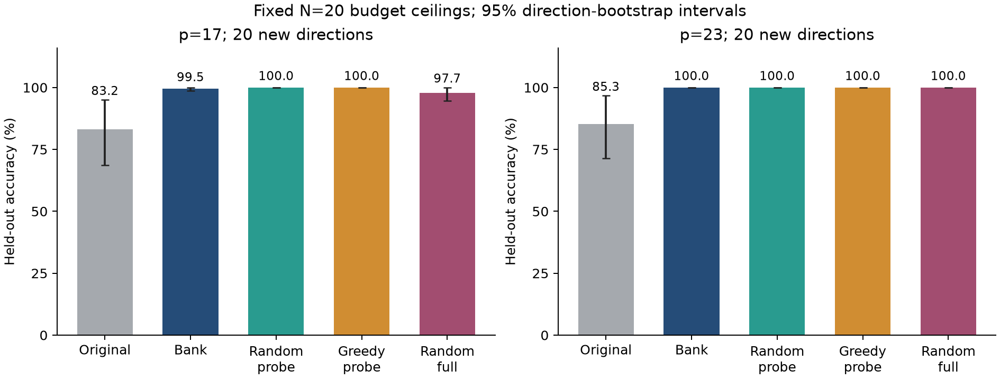

# RFM initialization: sign interactions and selection controls

**Xiao Tian** · Reproducible numerical research · RTX 4070 / FP64

[Read the paper](paper/main.pdf) · [中文说明](README.zh-CN.md) ·
[Code and manuscript data](studies/rfm-study/PUBLICATION_README.md) ·
[Selection control study](studies/initialization-selection/PUBLICATION_README.md) ·
[Download research archives](https://github.com/tianxiao1430-jpg/rfm-initialization-study/releases/tag/v1.0.0)

This repository studies how relative Fourier signs in a Recursive Feature Machine
(RFM) initialization affect modular-addition generalization under a symmetry
fixed-point split. It contains the manuscript dated September 7, 2026 (editorially revised September 12),
its reproducible code/data package, and a **separate subsequent control study**.
The control study has not been silently inserted into that manuscript.

## Manuscript

**Sign Interactions at Fixed Spectral Amplitudes: Predicting and Intervening on RFM
Initialization under a Symmetry Fixed-Point Split**

Training uses unequal input pairs; evaluation uses equal pairs. The manuscript
examines sign interventions that preserve each circulant Fourier amplitude and
the noncirculant residual. It reports 844 runs, including probes and repeats,
and 47,940 per-step records. These are **not 844 independent directions**.

On 30 prespecified directions, favorable signs improve mean accuracy by 11.86
percentage points over distance-matched random controls (post hoc seed-cluster
bootstrap 95% interval [7.15, 17.03]). The matched-control gain differs by modulus:
+15.69 points at p=17 and +4.20 at p=23. The favorable/unfavorable optimized
extremes (97.6% / 4.0%) must not be presented as an untreated-to-treated gain.

## Subsequent selection control: a strong simple baseline

We tested four selectors on 40 new directions, 20 per modulus. Validation points
were separate from final held-out points, and all selections were sealed before
final test evaluation. Each modulus had a fixed workload of 20 queries. Bank
construction is fully charged and amortized over those queries.

| Method | p=17 held-out accuracy | p=23 held-out accuracy | Charged fits/query p17 / p23 |
|---|---:|---:|---:|
| Unmodified initialization (descriptive reference) | 83.18% | 85.33% | 60 / 60, already counted within random full |
| Full response bank | 99.55% | 100.00% | 171 / 261 |
| Random short-probe selection | 100.00% | 100.00% | 170 / 258 |
| Greedy short-probe selection | 100.00% | 100.00% | 170 / 258 |
| Random full-training selection | 97.73% | 100.00% | 120 / 240 |

**The current pilot does not establish an accuracy advantage for the full response
bank.** Short probes are already strong in this setting. All six predeclared
bank-versus-competitor contrasts have Holm-adjusted p=1; lack of significance
does not demonstrate equivalence. Perfect results on this small sample do not
guarantee perfect performance on future directions. The study completed 160
selections and eight exact full-selector reruns.



## Data and verification

- Manuscript tables: [all runs](studies/rfm-study/results/all_runs.csv),
  [all steps](studies/rfm-study/results/all_steps.csv),
  [confirmation](studies/rfm-study/results/confirmation.csv),
  [interventions](studies/rfm-study/results/intervention.csv).
- Selection pilot: [all 200 method/reference rows](studies/initialization-selection/evaluation/directions.csv),
  [all 1,360 candidate records](studies/initialization-selection/analysis/candidates.csv),
  [paired comparisons](studies/initialization-selection/analysis/paired_comparisons.csv),
  [reproduction audit](studies/initialization-selection/verification/audit.json).
- Full saved trajectories and model arrays are in the separately downloadable
  research archives. The Git checkout contains the compact manuscript artifact
  and the pilot's source, tables, figures and per-test-point predictions.

Standard-library checks for the manuscript package:

```bash
cd studies/rfm-study
python src/verify_artifact.py
python publication_check.py
```

CUDA reproduction commands and exact dependency records are in each study's
publication README. Recorded hashes refer to particular packages; historical
local audit reports do not assert that omitted arrays exist in this Git checkout.

## Scope and status

These are conditional synthetic Gaussian RFM findings, not a universal neural
network initialization method or a claim that short-training selection is new.
The paper has no verified public arXiv identifier and this repository makes no
peer-review or acceptance claim. Publication here is an open research artifact.

The work builds on Mallinar et al., [ICML 2025](https://proceedings.mlr.press/v267/mallinar25a.html),
and Tomàs et al., [Breaking Data Symmetry](https://arxiv.org/abs/2604.00316).
Short-training selection also relates to [Successive Halving](https://proceedings.mlr.press/v51/jamieson16.html)
and [Hyperband](https://www.jmlr.org/papers/v18/16-558.html).

## Attribution

Author: Xiao Tian. OpenAI Codex was used during the research.
See [LICENSES.md](LICENSES.md), the GPL [LICENSE](LICENSE), and each study's
original notices for upstream attribution.

## Hugging Face

[The complete research mirror](https://huggingface.co/datasets/tianxiao1430-jpg/rfm-initialization-study) is public on Hugging Face, including the paper, six result tables, reports and all three archives. Downloads are available from both platforms.
