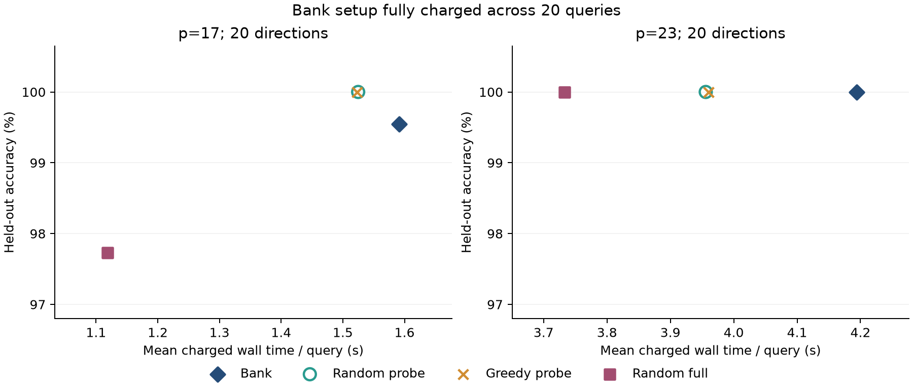

# 短训练能否替代完整响应预测库？

Xiao Tian · RTX 4070 上的 RFM 初始化选择试验 · 2026-09-09（日本时间）

**这次试验没有发现完整预测库的准确率优势。随机短训练筛选已经在40个新方向上全部达到100%，贪心短训练同样如此。** 在预先固定的20次查询预算下，完整预测库的总计费耗时均值还略高。因此，现有证据支持保留简单短训练作为强基线，暂不把完整预测库描述为更优或更省算力的初始化算法。

这里的100%只描述本次有限样本，不证明新方向、更难任务或其他参数下始终成功。此记录由Codex辅助实现、执行和整理；研究主线与开展本项比较由Xiao Tian确认。原论文及提交材料未修改，新结果尚未公开或投稿。

## 做了什么

沿用原研究的高斯RFM和模加法：训练所有a≠b的有序对，用部分a=b的点选优，其余对角线点在全部模型选定后统一测试。p17/p23分别使用6/8个验证点、11/15个测试点，每个模数20个新随机方向。独立样本是方向，不是每个测试点或每次训练。

每个候选保留初始化的傅里叶幅度和非循环残差，只改变共同候选空间内的符号关系。完整预测库通过二次响应张量排序；随机短训练和逐位贪心短训练在第10轮按验证准确率、归一化间隔选优，再续算到第59轮；随机完整训练以同一随机候选序列的可支付前缀作为基线。

规则、种子、预算和统计方法先写入[protocol.md](protocol.md)与[plan.json](plan.json)，代码在[freeze.json](freeze.json)中封存。全部160次选优于2026-09-08 16:40:01 UTC封存，测试评估于16:40:37 UTC开始。已知模加规则本身能确定全部标签，因此这个隔离控制的是自适应读取测试结果，不能把它称为未知任务泛化。

## 主要结果：实测值

| 方法 | p17平均测试准确率 | p23平均测试准确率 | 完全正确方向 p17 / p23 |
|---|---:|---:|---:|
| 未修改初始化，描述性参考 | 83.18% | 85.33% | 13/20 · 13/20 |
| 完整预测库 | 99.55% | 100.00% | 19/20 · 20/20 |
| 随机短训练筛选 | 100.00% | 100.00% | 20/20 · 20/20 |
| 贪心短训练筛选 | 100.00% | 100.00% | 20/20 · 20/20 |
| 随机完整训练筛选 | 97.73% | 100.00% | 17/20 · 20/20 |

完整预测库的反例为p17、seed2004：验证全对，最终测试10/11正确。随机完整训练在p17的seed2005、2006、2009分别为10/11、8/11、10/11。所有方向均保留在[逐方向原始表](evaluation/directions.csv)，没有按结果剔除种子。

误差线为20个方向层面的百分位bootstrap区间。全体方向100%时，经验bootstrap退化为[100%,100%]；**这不是总体准确率确定为100%的置信保证**。当前基准已出现明显的准确率上限问题。

预先指定的六项配对比较如下，差值为完整预测库减竞争方法：

| 模数 / 对照 | 均值差，百分点 | 配对bootstrap 95%区间 | 库胜 / 平 / 负 | 原始符号翻转p值 | Holm后p值 |
|---|---:|---:|---:|---:|---:|
| p17 / 随机短训练 | −0.45 | [−1.36, 0.00] | 0 / 19 / 1 | 1.0000 | 1.0000 |
| p17 / 贪心短训练 | −0.45 | [−1.36, 0.00] | 0 / 19 / 1 | 1.0000 | 1.0000 |
| p17 / 随机完整训练 | +1.82 | [−0.45, 5.00] | 3 / 16 / 1 | 0.5002 | 1.0000 |
| p23 / 随机短训练 | 0.00 | [0.00, 0.00] | 0 / 20 / 0 | 1.0000 | 1.0000 |
| p23 / 贪心短训练 | 0.00 | [0.00, 0.00] | 0 / 20 / 0 | 1.0000 | 1.0000 |
| p23 / 随机完整训练 | 0.00 | [0.00, 0.00] | 0 / 20 / 0 | 1.0000 | 1.0000 |

10,000次方向配对bootstrap、100,000次配对符号翻转，固定随机种子20260909，Holm同时校正六项比较。符号翻转依赖对称配对零假设，非实验随机分配检验；区间未做多重校正。没有显著差异不能解释为已经证明等效，本次也没有预先设定等效界限。

连续指标保留了区别：完整预测库的平均归一化测试间隔为p17的1.876、p23的2.251；随机短训练为1.567、1.891，贪心短训练为1.782、2.011。较大间隔是描述性观察，尚未转化为对噪声、参数变化或新任务的实测鲁棒性收益，不能据此挽救一个未经验证的优越性主张。

## 成本：先完整计入构建预测库

两组都固定每模数N=20次查询。预测库需要37/67条完整轨迹，分别消耗2,220/4,020次核拟合；实测构建墙钟20.63/63.19秒。所有方法获得相同预算上限，但不足以再完成一个候选的余数不强行填满。

| 方法 | p17拟合次数/查询 | p17计费秒/查询 | p23拟合次数/查询 | p23计费秒/查询 |
|---|---:|---:|---:|---:|
| 完整预测库，含1/20构建成本 | 171 | 1.592 | 261 | 4.194 |
| 随机短训练 | 170 | 1.525 | 258 | 3.956 |
| 贪心短训练 | 170 | 1.523 | 258 | 3.960 |
| 随机完整训练 | 120 | 1.118 | 240 | 3.733 |

随机/贪心短训练分别探测11/19个候选，每个11次拟合，然后给选定候选续算49次。随机完整训练为2/4个候选。原始初始化已经包含在随机完整训练中，不再重复计费。两种短训练的耗时相近；本次没有观察到贪心相对随机筛选的准确率收益。

只需要一次选择时，按实测均值计算，预测库需约21.19/64.22秒，而随机短训练需约1.52/3.96秒。已经建好库之后，其在线选择加训练为0.56/1.03秒。按本次延迟并假设搜索投入不变，库对短训练的时间盈亏平衡点约为22次查询；对随机完整训练，p17/p23约为37/24次。这些是**工作量外推**，不是其他预算下新做过的精度试验。

耗时包含同步CUDA计算及模型/日志保存，不含进程启动、数据或张量加载、预热、独立核查和最终测试评估。当前桌面负载和磁盘I/O可能影响秒数，4%–6%左右的差异不宜宣传为可迁移的硬件加速结论。

## 这项结果给论文增加了什么

它补上了此前未验证的关键替代解释：**好结果是否只是多尝试几个候选就能得到？** 本次随机短训练已经足够，完整响应预测库的必要性没有成立。原研究关于固定幅度符号关系的现象和机制分析仍可保留，但“复杂预测器带来实际初始化优势”应保持受限表述。

最强的另一种解释是：两个模数、当前扰动幅度和当前预算使任务太容易，简单方法与复杂方法都很快碰到100%上限。这次研究无法区分“预测库一直不需要”和“在更难条件下才有价值”。较大连续间隔与多次查询摊销也给后者留下可能性，但都需要新的实证。

下一项最有判断价值的候选，是**降低搜索预算，寻找短训练筛选开始失效的边界**：预先固定更少候选、更短探测长度及至少一个较大模数，在独立新方向上比较成功率/间隔/成本曲线，并检验早期分数为什么能预测最终结果。当前40个方向只能作为设计探索资料，不能再当作新确认集。不宜仅在同样配置下继续累加大量种子；那很可能只是重复观测准确率上限。此候选尚未执行，也未据此宣称新颖性。

## 核查与数据交付

- 40个新方向 × 4种选优，共160次选优；另有104条预测库探测轨迹。共1,464条实际候选/库轨迹、32,960次核拟合。它们仍只有40个独立方向。预热、原实现核对和8次复现选优不计入方法成本。
- 全部160项决策按日志重放，200行最终数据从原始预测复算通过。8次完整选优重跑的候选分数、选择和最终数组均精确一致。
- 原实现完整轨迹、短断点续算均精确一致；候选范数、幅度、残差和正定性核查通过。最终核矩阵最大条件数约6.67×10⁴，最大相对求解残差约7.57×10⁻¹⁴；按预定阈值（类别中心化RMS的10⁻⁸倍）未发现最终分数近并列点。这些诊断不等同于任意硬件或任意精度下的数值证明。
- 原论文目录全部已记录文件的散列未变；GPL来源保留。第一次启动因封存尚未结束而在运行样本前停止，错误记录保留；正式160项均完成，无样本失败或排除。
- 统计方案及分析脚本在读取测试前封存。结果后仅修改成本图的重叠标签和标记，未改变数据、统计或选优，见`analysis/figure-readability.json`。

读取入口：[facts.json](facts.json)、[逐方向数据](evaluation/directions.csv)、[全部候选分数](analysis/candidates.csv)、[配对统计](analysis/paired_comparisons.csv)、[全部方向图](analysis/all-directions.png)、[核查报告](verification/audit.json)。逐点分数和标签保存在`evaluation/*.npz`，模型及验证轨迹在`runs/`，字段解释见[data_dictionary.md](data_dictionary.md)，复现命令见[README.md](README.md)。

**材料状态：本地可复查的后续试验报告，尚未获得外部评审。** 本轮未做新的系统文献查新，因此不能据此声称别人没有做过短训练选择或随机搜索。
