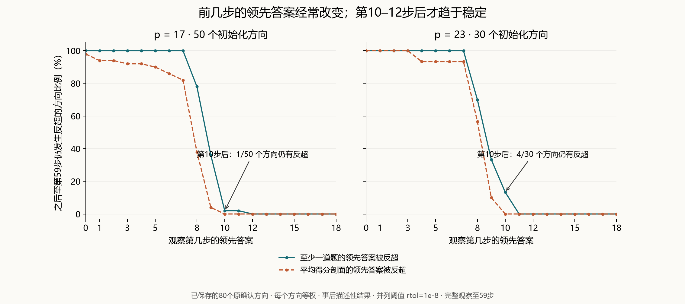
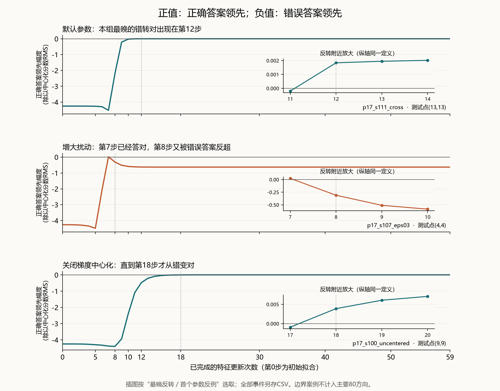

# Training-time leader reversals in the original RFM study

**Xiao Tian · September 13, 2026 · Post hoc descriptive supplement**

[中文报告与图表](研究报告.md) · [Reproduction and data guide](PUBLICATION_README.md)

Early leading answers can be overtaken. Across the original 80 confirmation
directions (50 at p=17; 30 at p=23), every direction has at least one test-point
leader at step 1, and at step 5, that is later overtaken. At step 10 this remains
true for 5/80 directions and seven test points. The latest pointwise reversal is
at step 12; the aligned mean-score profile stabilizes by step 10. Stability is
checked at every subsequent step through 59, under the stated tie tolerance.

| Anchor step | Directions with at least one later pointwise displacement |
|---|---:|
| 1 | 80/80 |
| 5 | 80/80 |
| 10 | 5/80 (7 test points) |
| 12 | 0/80 through the recorded endpoint at 59 |

The primary sample has 1,254 wrong-to-correct test-point transitions, of which
1,168 (93.1%) occur at steps 8 or 9, and no clear correct-to-wrong transition.
However, 286 test points still have a wrong leader at the endpoint: stability
does not imply correctness. Test points within a direction are not independent.

Existing matched amplitude controls provide counterexamples: raising epsilon
from 0.01 to 0.03 produces 27 correct-to-wrong transitions in 3/20 directions,
versus none in the same 20 directions at 0.01. Disabling gradient centering can
delay a reversal to step 18. These boundary cases are reported separately.

The analysis reads all 844 saved trajectories (794 through step 59, 50 short
probes through step 5), without new training. It does not establish causal
locking, a universal stopping rule, or a mechanism for the quadratic response
model. This is a later analysis of existing data, separate from the original
manuscript and the subsequent initialization-selection experiment.

## Endpoint stratification and mechanism limits

All 1,540 primary test points start clearly incorrect. The 1,254 endpoint-correct
points each have exactly one wrong-to-correct transition. The 286 endpoint-wrong
points are never clearly correct. No primary point changes correctness twice,
although its leading wrong class can change repeatedly. These strata condition
on known endpoints and do not establish a mechanism for directional dynamics.

The name `confirmation` identifies the original experiment phase, not independent
confirmation of this later analysis. The 8-9-step transition concentration remains
unexplained. Metric matrices were saved only at steps 0, 1, 2, 5, 10 and 59 for all
80 primary runs; there are no step-8/9 matrices to test a sector-energy threshold
at those steps. Label stability alone does not establish that later training only
refines scores, nor does it prove the cause of a short-selector baseline's strength.

[Endpoint strata](endpoint_stratification.csv) ·
[Per-point correctness histories](endpoint_point_history.csv) ·
[Metric-state coverage](saved_metric_coverage.csv)

OpenAI Codex was used during the research. Existing repository licenses and
attribution apply; this supplement makes no peer-review or novelty claim.
